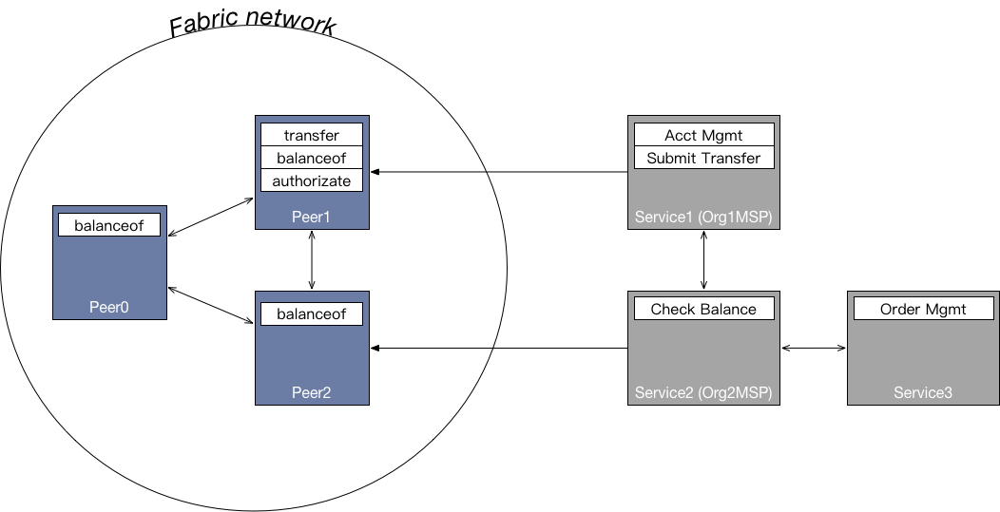

# 基于hyperledger fabric的通证实现

## How to install chaincode

```bash
docker exec -it cli bash
cd /opt/gopath/src/bitbucket.org/at2chain/chaincode-token/scripts
. install.sh

```

## How to execute chaincode

智能合约token实现了类似于erc20的supply, transfer, balanceof等功能

`supply`接口在智能合约实例化的时候给“0x00”这个账户注入100000000枚token, supply接口不能被外部调用

`transfer`接口实现账户间转账的功能, 示例:

```bash
peer chaincode invoke -o orderer.at2chain.com:7050  --tls true --cafile ${ORDERER_CA} -C $CHANNEL_NAME -n $CC_NAME -c '{"Args":["transfer","'mike","tom","100"]}'
```

`balanceof`接口实现账户间转账的功能, 示例:

```bash
peer chaincode invoke -o orderer.at2chain.com:7050  --tls true --cafile ${ORDERER_CA} -C $CHANNEL_NAME -n $CC_NAME -c '{"Args":["balanceof","'tom'"]}'
```


## 并发实验

### 给 mike 账号转账 1 个token 1000 次

```bash
. many-transfers.sh 0x00 mike 1
```

macbook pro 2017版 环境执行 耗时: 386s

查询 mike 账号余额

```bash
. balanceof.sh mike
```

结果:1000

执行 耗时: 6s

### 使用传统key value方式 给 mike 账号添加 1 个token 1000 次

```bash
. many-updates-traditional.sh mike 1
```

耗时: 401s

使用传统key value方式 查询 mike 账号余额

```bash
. get-traditional.sh mike
```

结果:123

执行 耗时: 1s

### Conclusion

在高并发场景下, 两种模式耗时相差不多, 但是在传统key value的存取模式下, 最终结果是错误的, 原因是fabric的每个写操作需要耗费数秒时间, 在写操作执行过程中, 下一个脚本执行过程中的读操作会获取错误数据, 在这个过程中服务端日志会出现一些不相关的警告, 但不会抛出异常, 也就是说这个数据错误是无法被捕捉的.

## An example architecture

